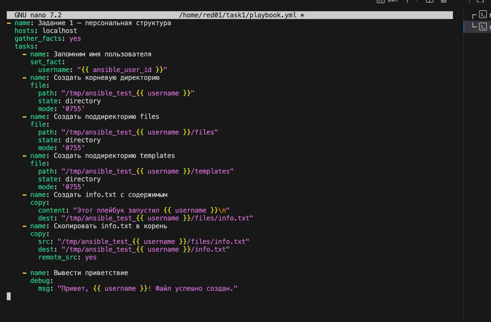
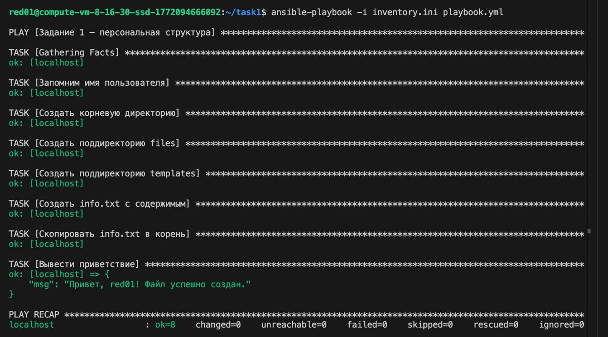
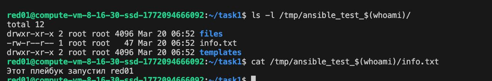

# Ansible - Задание 1: Мой первый плейбук

## Плейбук (playbook.yml)

Содержимое плейбука в редакторе.

## Запуск плейбука

Запуск командой `ansible-playbook -i inventory.ini playbook.yml`. Все 8 заданий выполнены успешно, финальное сообщение: "Привет, red01! Файл успешно создан."

## Результат - содержимое папки и файла

Созданная структура в `/tmp/ansible_test_red01/`: поддиректории `files` и `templates`, файл `info.txt`. Содержимое файла: `Этот плейбук запустил red01`.

