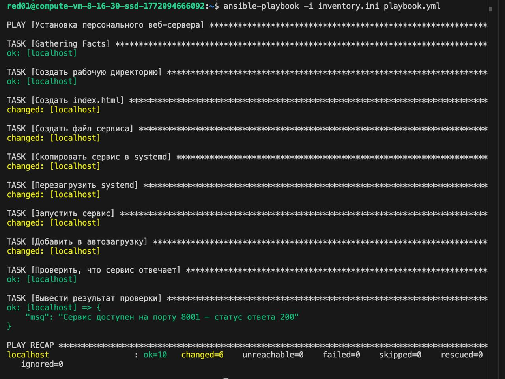
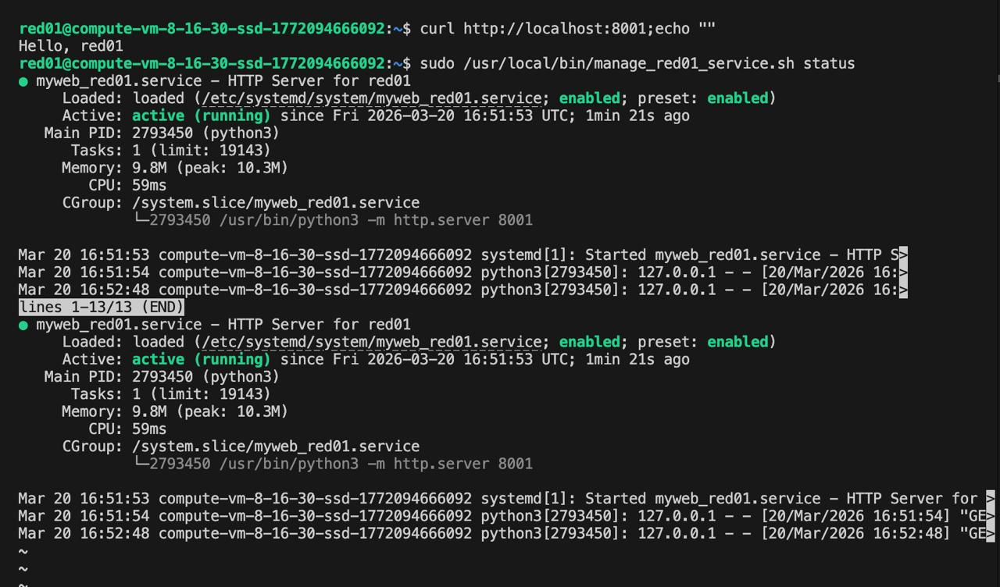
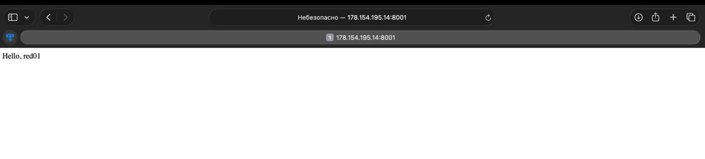
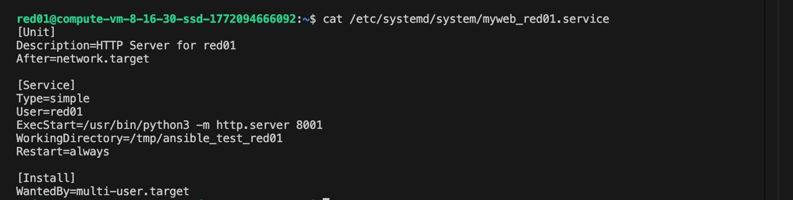

# Ansible - Задание 2: Сервис на уникальном порту

- **Логин:** red01
- **Порт:** 8001
- **Сервис:** myweb_red01

---

## 1. Описание задач плейбука (блоки tasks)

### Задача 1: Создать рабочую директорию
```yaml
- name: Создать рабочую директорию
  file:
    path: "/tmp/ansible_test_{{ username }}"
    state: directory
    mode: '0755'
```
 Создаёт персональную рабочую директорию `/tmp/ansible_test_red01`, в которой будут храниться файлы веб-сервера. `mode: '0755'` означает что владелец может читать, писать, создавать и удалять файлы внутри папки, остальные могут только читать и заходить внутрь папки. Директория уникальна для каждого студента.

---

### Задача 2: Создать index.html
```yaml
- name: Создать index.html
  copy:
    dest: "/tmp/ansible_test_{{ username }}/index.html"
    content: "Hello, {{ username }}"
    mode: '0644'
```
Cоздаёт файл `index.html` в рабочей директории. Этот файл Python HTTP-сервер будет отдавать в ответ на запросы браузера. В файле находится персональное приветствие юзеру.

---

### Задача 3: Создать файл сервиса из шаблона
```yaml
- name: Создать файл сервиса
  template:
    src: myweb.service.j2
    dest: "/tmp/ansible_test_{{ username }}/myweb_{{ username }}.service"
```
Берёт шаблон `myweb.service.j2`, подставляет в него переменные (`username = red01`, `http_port = 8001`) и генерирует готовый файл конфигурации systemd-сервиса, без этого файла systemd не знает как запускать сервис.

---

### Задача 4: Скопировать сервис в systemd
```yaml
- name: Скопировать сервис в systemd
  command: cp /tmp/ansible_test_{{ username }}/myweb_{{ username }}.service /etc/systemd/system/
```
Копирует сгенерированный файл сервиса в системную директорию `/etc/systemd/system/`. Оттуда systemd читает конфигурации всех сервисов, без этого шага systemd не видит наш сервис.

---

### Задача 5: Перезагрузить systemd
```yaml
- name: Перезагрузить systemd
  command: systemctl daemon-reload
```
После добавления нового файла сервиса systemd необходимо перечитать конфигурации. `daemon-reload` говорит systemd: "обнови список сервисов". Без этого шага systemd продолжит работать со старым списком и не увидит новый сервис.

---

### Задача 6: Запустить сервис
```yaml
- name: Запустить сервис
  command: /usr/local/bin/manage_{{ username }}_service.sh start
```
Запускает Python HTTP-сервер как системный процесс. После этого шага сервер начнет ждать входящих сообщений на порту `8001` и принимать HTTP-запросы.

---

### Задача 7: Добавить в автозагрузку
```yaml
- name: Добавить в автозагрузку
  command: /usr/local/bin/manage_{{ username }}_service.sh enable
```
Добавляет сервис в автозагрузку системы. Это означает что при каждом перезапуске сервера Python HTTP-сервер будет запускаться автоматически.

---

### Задача 8: Проверить что сервис отвечает
```yaml
- name: Проверить, что сервис отвечает
  uri:
    url: "http://localhost:{{ http_port }}"
    method: GET
  register: response
  ignore_errors: yes
```
Отправляет HTTP GET-запрос на `http://localhost:8001` прямо из плейбука, чтобы убедиться что сервис запустился и отвечает. Результат сохраняется в переменную `response`.

---

### Задача 9: Вывести результат проверки
```yaml
- name: Вывести результат проверки
  debug:
    msg: "Сервис доступен на порту {{ http_port }} - статус ответа {{ response.status }}"
```
Выводит в консоль статус HTTP-ответа. Статус `200` означает что сервис работает корректно. Это позволяет сразу видеть результат прямо в выводе плейбука, не запуская отдельные команды проверки.

---

## 2. Результат выполнения плейбука



---

## 3. Результаты команд проверки

### a. curl и статус сервиса

```
curl http://localhost:8001;echo ""
sudo /usr/local/bin/manage_red01_service.sh status
```



### b. Страница в браузере: http://178.154.195.14:8001/



---

## 4. Что такое Jinja2 шаблоны и для чего они нужны в Ansible

**Jinja2** - это язык шаблонов для Python. В Ansible он используется для создания файлов с переменными, которые подставляются при запуске плейбука. Вместо того чтобы писать отдельный файл для каждого пользователя, пишется один шаблон, в котором переменные обозначаются двойными фигурными скобками: {{ username }}, {{http_port }}. При запуске плейбука Ansible подставляет реальные значения вместо переменных и генерирует готовый файл. В нашем задании шаблон myweb.service.j2 с переменными {{ username }} и {{http_port }} превратился в готовый файл сервиса с реальными значениями **red01** и **8001**.  Для **red02** тот же шаблон сгенерировал бы файл с портом **8002** без каких-либо изменений в шаблоне. Плюсы: файлы генерируются с нужными значениями автоматически и не надо ничего вручную менять в каждом файле, следовательно, исключаются различные ошибки.

---

## 5. Содержимое сервисного файла



---

## 6. Описание сервисного файла myweb_red01.service
```
[Unit]
Description=HTTP Server for red01
After=network.target

[Service]
Type=simple
User=red01
ExecStart=/usr/bin/python3 -m http.server 8001
WorkingDirectory=/tmp/ansible_test_red01
Restart=always

[Install]
WantedBy=multi-user.target
```
Сервисный файл - это конфигурация для systemd (менеджера служб Linux), которая описывает как запускать, останавливать и управлять процессом. Без этого файла systemd не знает о существовании сервиса.

`[Unit]` - секция с общей информацией о сервисе и его зависимостями

`Description=HTTP Server for red01` - текстовое описание сервиса, отображается при выполнении `systemctl status`

`After=network.target` - сервис запускается только после того как поднялась сеть, иначе Python-сервер стартует раньше сети и не сможет принимать подключения

`[Service]` - секция с параметрами запуска процесса

`Type=simple` - тип процесса, простой, systemd считает сервис запущенным сразу после старта команды

`User=red01` - сервис запускается от имени пользователя **red01**, у каждого студента свой процесс под своим пользователем, это обеспечивает изоляцию

`ExecStart=/usr/bin/python3 -m http.server 8001` - команда, которую systemd выполняет при запуске сервиса, запускает встроенный HTTP-сервер Python на порту 8001

`WorkingDirectory=/tmp/ansible_test_red01` - рабочая директория, папка из которой сервер отдаёт файлы, именно здесь лежит `index.html`

`Restart=always` - при любом падении сервиса systemd автоматически перезапускает его

`[Install]` - секция которая описывает при каких условиях сервис добавляется в автозагрузку

`WantedBy=multi-user.target` - сервис запускается при стандартной загрузке системы, активируется командой `systemctl enable`
