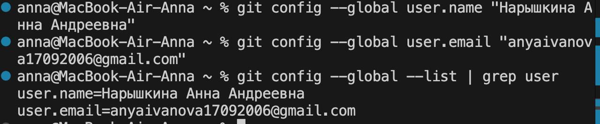
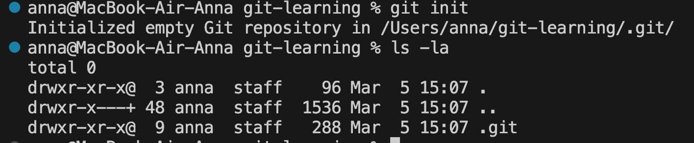
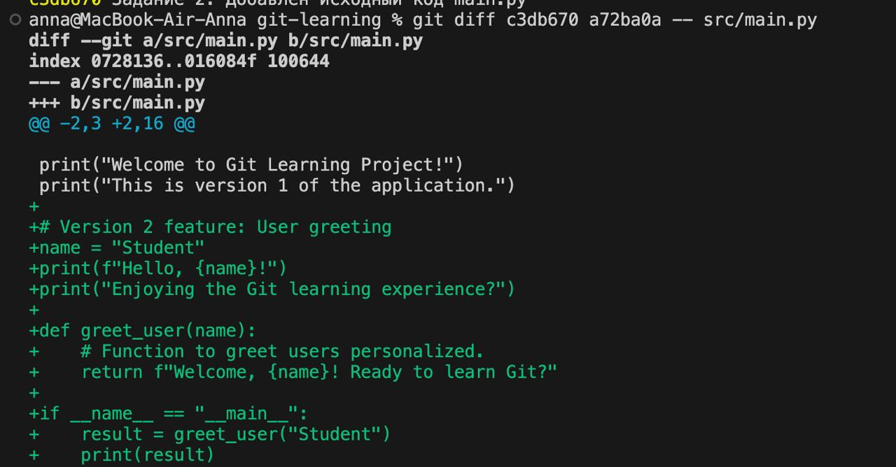
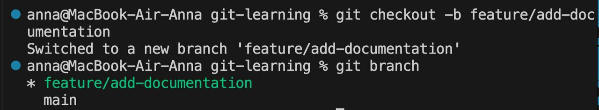
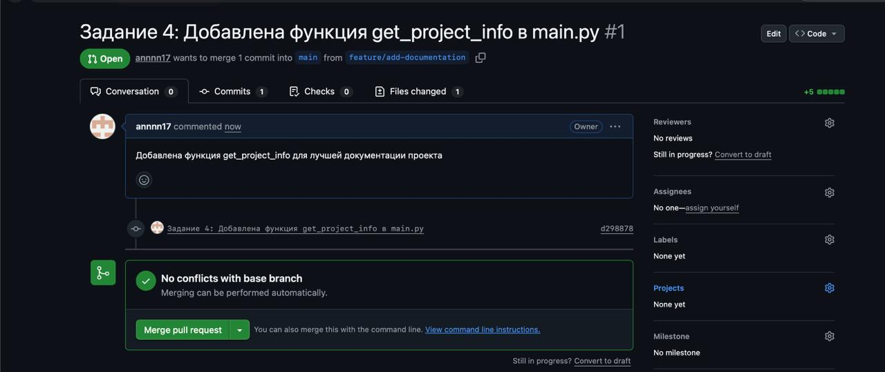
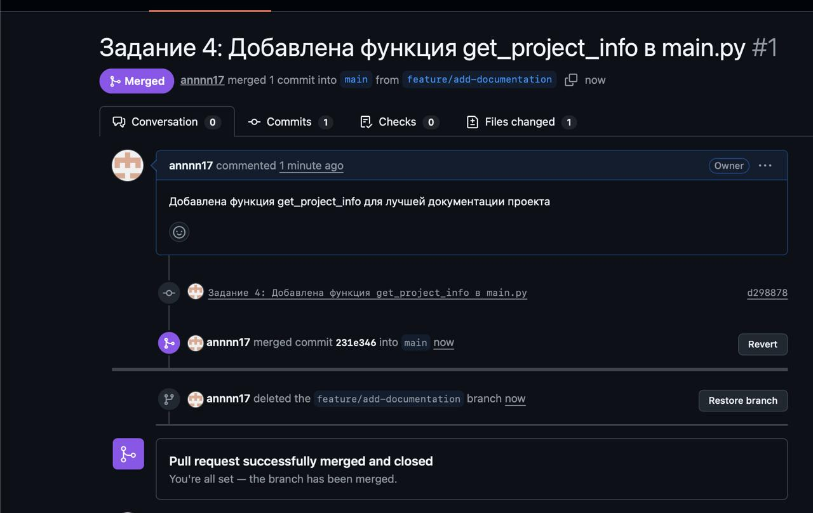
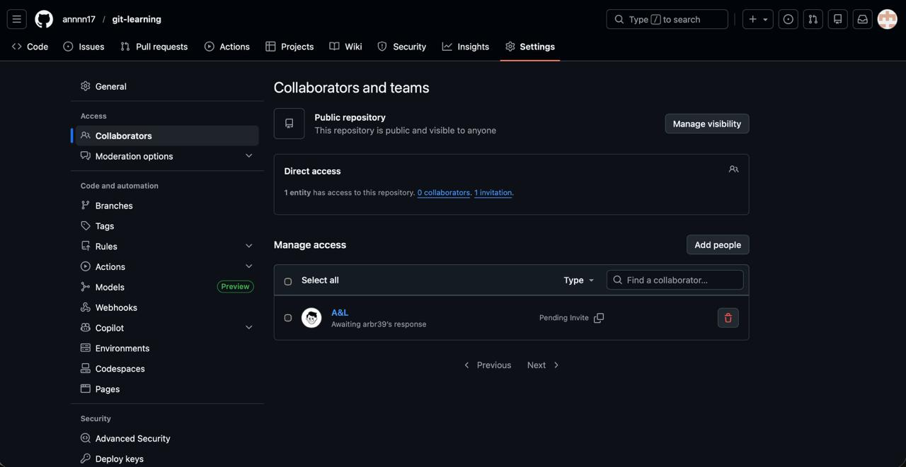
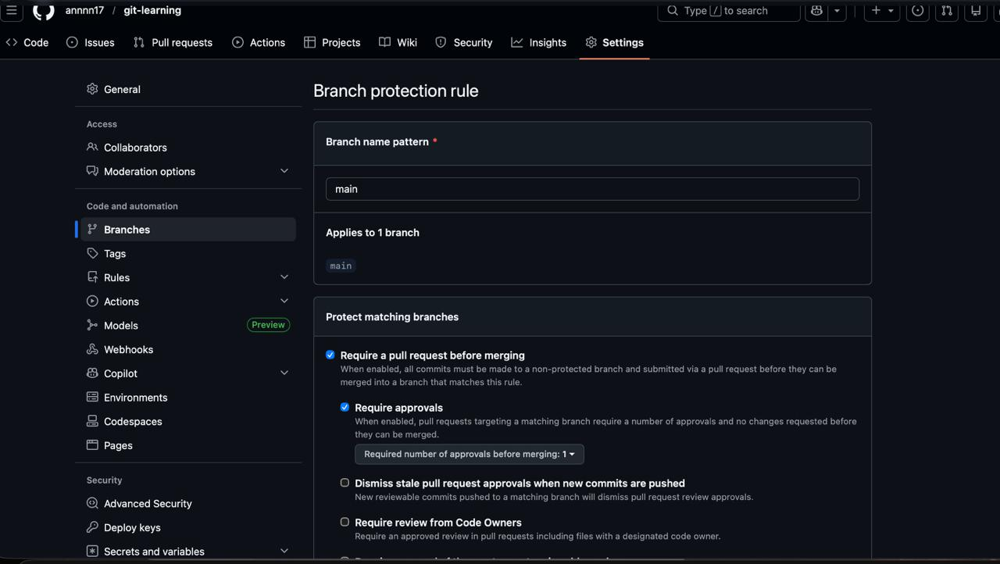
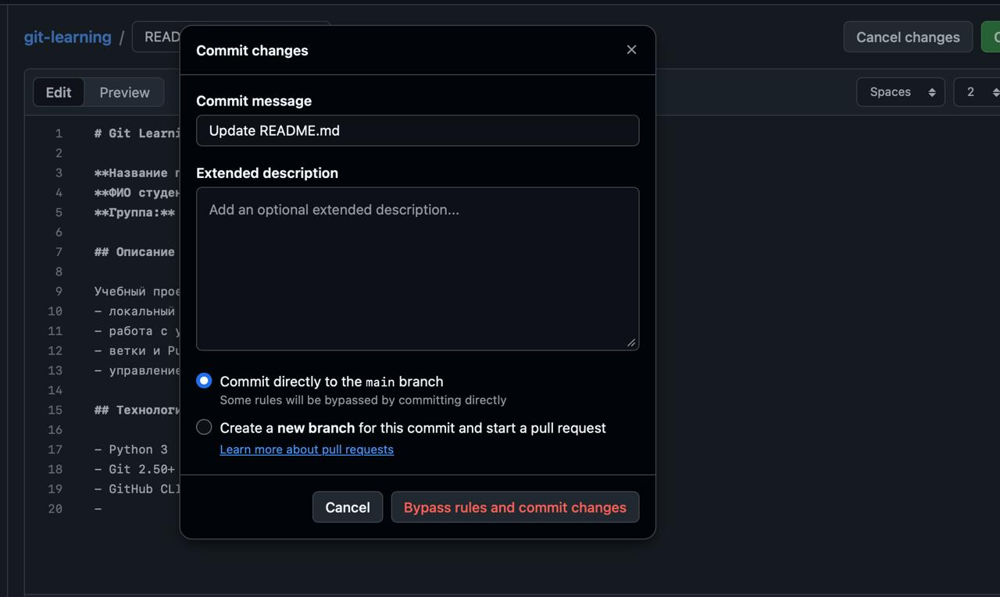

# Отчёт по работе с Git и GitHub

**ФИО студента:** Нарышкина Анна Андреевна
**Группа:** 241
**GitHub репозиторий:** https://github.com/annnn17/git-learning

## Цель работы

Освоить базовые операции Git, работу с удалённым репозиторием GitHub, ветвлением, Pull Request и управлением доступами.

## Выполненные задания

### Задание 1: Основы Git

-  Проверена установка Git
  ```bash
  git --version
  ```

-  Настроены глобальные параметры (имя и почта)
  ```bash
  git config --global user.name "Нарышкина Анна Андреевна"
  git config --global user.email "anyaivanova17092006@gmail.com"
  git config --global --list
  ```
  

-  Создан локальный репозиторий
  ```bash
  mkdir git-learning
  cd git-learning
  git init
  ```
  

-  Создан файл README.md с информацией проекта

-  Добавлены файлы в индекс и создан первый коммит
  ```bash
  git status
  git add README.md
  git commit -m "Задание 1: Создан README.md с информацией о проекте"
  git log
  ```

### Задание 2: Хранение исходного кода

-  Создан каталог src с файлом main.py
  ```bash
  mkdir src
  # Создан файл src/main.py с исходным кодом
  git add src/
  git commit -m "Задание 2: Добавлен исходный код main.py"
  ```

-  Произведены изменения и просмотрены различия
  ```bash
  git diff src/main.py
  ```
  

-  Зафиксированы изменения новым коммитом
  ```bash
  git add src/main.py
  git commit -m "Задание 2: Добавлена функция greet_user в main.py"
  ```

-  Просмотрена история изменений файла
  ```bash
  git log --oneline src/main.py
  ```

### Задание 3: Работа с удалённым репозиторием GitHub

-  Авторизация в GitHub CLI
  ```bash
  gh auth login
  ```

-  Создан репозиторий на GitHub и отправлен код
  ```bash
  gh repo create git-learning --source=. --remote=origin --push 
  ```

-  Произведены изменения через веб-интерфейс GitHub и получены на локальный компьютер
  ```bash
  git pull origin main
  ```

### Задание 4: Merge Requests и Code Review

-  Создана новая ветка для разработки
  ```bash
  git checkout -b feature/add-documentation
  git branch
  ```
  

-  Внесены изменения в файл src/main.py (добавлена функция greet_user)

-  Зафиксированы изменения коммитом
  ```bash
  git diff src/main.py
  git add src/main.py
  git commit -m "Задание 4: Добавлена функция get_project_info в main.py"
  ```

-  Ветка отправлена в удалённый репозиторий
  ```bash
  git push origin feature/add-documentation
  ```

-  Создан Pull Request через веб-интерфейс GitHub
  - Описание PR: "Добавлена функция get_project_info для лучшей документации проекта"
  - Добавлен комментарий к PR

  

  

-  Pull Request слит в основную ветку через веб-интерфейс
  - Выполнено: Merge pull request и Confirm merge

-  Локальный репозиторий обновлен и локальная ветка удалена
  ```bash
  git checkout main
  git pull origin main
  git branch -d feature/add-documentation
  git branch -a
  ```
  

### Задание 5: Управление доступами

-  Добавлен пользователь в репозиторий

  

-  Настроена защита основной ветки main
  - Параметры:
    - Branch name: main
    - Require a pull request before merging: отметила
    - Require approvals: 1
  - Результат: Защита ветки активна, запрещены прямые изменения main

  

  

-  Проверена невозможность прямого редактирования ветки main
  - Попытка редактирования файла в веб-интерфейсе заблокирована

## Преимущества Git и систем удаленных репозиториев

Git и GitHub предоставляют значительные преимущества для командной разработки:

### Преимущества для командной разработки:

1. История изменений: Полная история всех изменений с возможностью вернуться к любой версии кода. Каждый коммит содержит информацию об авторе, времени и описании изменений.

2. Совместная разработка: Несколько разработчиков могут работать одновременно над разными ветками, минимизируя конфликты при слиянии.

3. Code Review: Pull Request позволяют проверять код перед включением в основную ветку, обеспечивая качество и безопасность кода.

4. Ветвление: Возможность создавать отдельные ветки для каждой функции или исправления, изолируя изменения и упрощая разработку.

5. Управление доступами: Контроль прав доступа к репозиторию и защита критических веток (main) от случайных изменений.

6. Управление версиями: Простое отслеживание версий проекта через теги и релизы.

7. Резервное копирование: Код хранится на удаленном сервере (GitHub), обеспечивая безопасность и доступность.

8. Прозрачность: Все изменения видны в истории, что помогает понять, как развивался проект.

## Выводы

Работа с Git и GitHub является стандартом в современной разработке программного обеспечения. Основные концепции Git (локальные репозитории, коммиты, ветки) и GitHub (Pull Request, управление доступами, защита веток) успешно освоены и применены на практике. Система контроля версий обеспечивает надежное управление кодом, облегчает командную разработку и повышает качество программного продукта.
